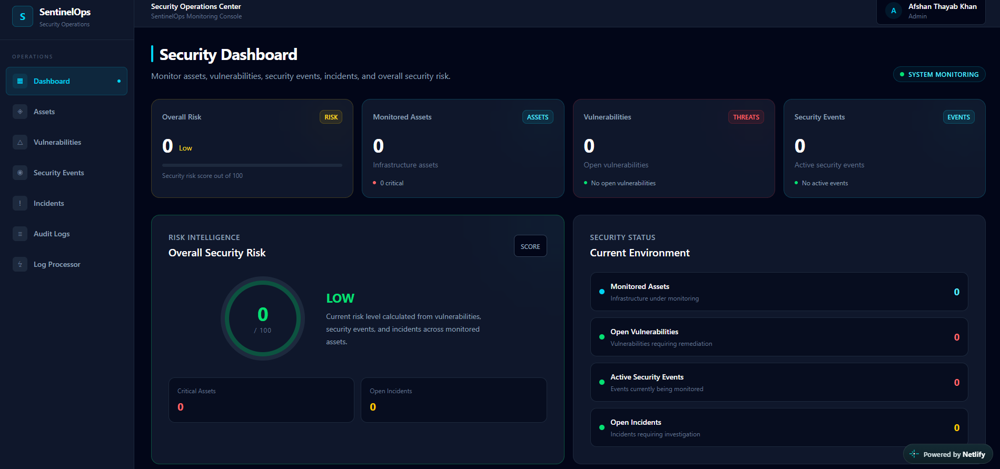
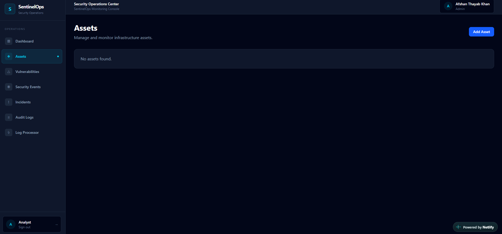
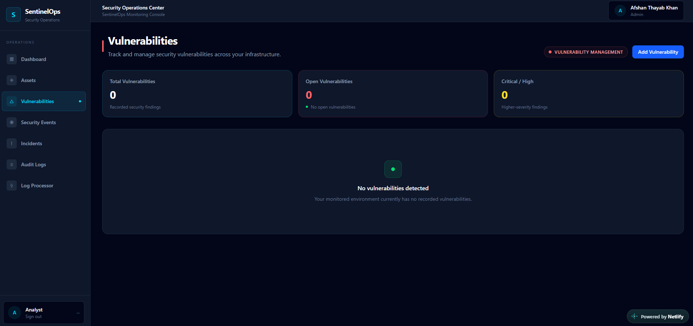
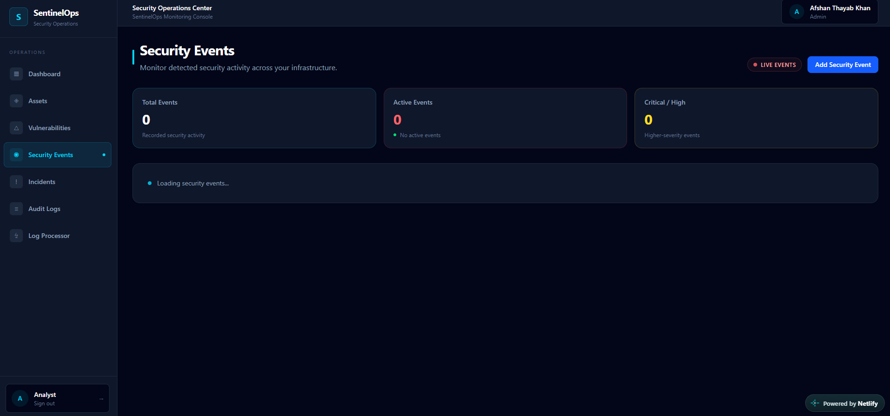
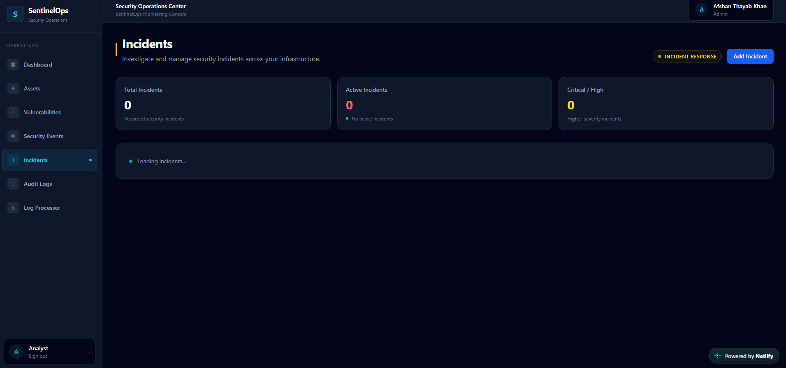
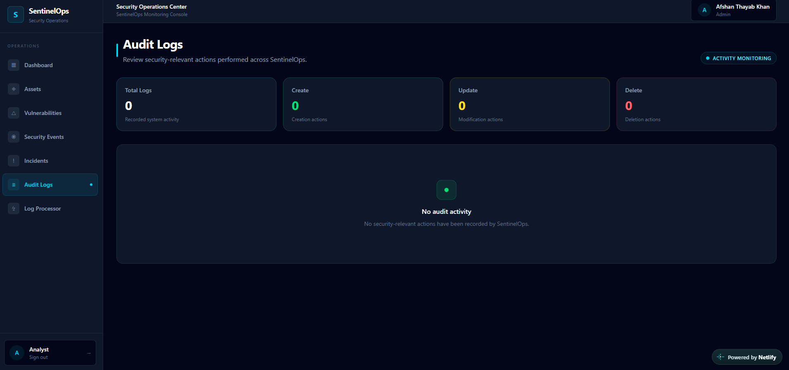
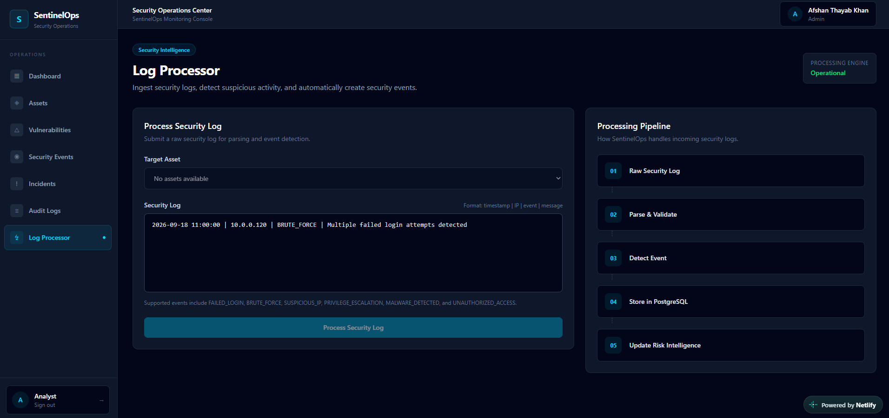

# SentinelOps

## Secure IT Operations & Security Monitoring Platform

SentinelOps is a full-stack **IT operations and cybersecurity monitoring platform** designed to give organizations a centralized view of their infrastructure, vulnerabilities, security events, incidents, audit activity, and overall security risk.

It combines **modern web development, backend engineering, database design, and cybersecurity principles** into a single operational platform.

The goal of SentinelOps is not to replace enterprise SIEM platforms. Instead, it demonstrates how a security-focused application can be designed to bring important security operations into one centralized workflow.

---

## Live Application

### Frontend

https://sentinelopss.netlify.app/

### Backend API

https://sentinelops-api-nh5g.onrender.com/

### Interactive API Documentation

https://sentinelops-api-nh5g.onrender.com/docs

---

# What Is SentinelOps?

Modern organizations can have hundreds or thousands of:

* Servers
* Databases
* Workstations
* Applications
* APIs
* Cloud resources
* Network systems

At the same time, security teams need to keep track of:

* Vulnerabilities
* Suspicious activity
* Failed authentication attempts
* Security incidents
* Incident investigations
* Analyst activity
* Organizational risk

When this information is scattered across different tools, spreadsheets, logs, and dashboards, it becomes difficult to understand the organization's overall security posture.

**SentinelOps provides a centralized security operations console where this information can be managed and monitored from a single application.**

---

# The Problem SentinelOps Addresses

A small or medium-sized organization may have information spread across multiple systems:

```text
Infrastructure
     │
     ├── Servers
     ├── Databases
     ├── Workstations
     └── Applications
              │
              ▼
        Security Data
              │
       ┌──────┼──────┐
       ▼      ▼      ▼
 Vulnerabilities  Events  Incidents
       │      │      │
       └──────┼──────┘
              ▼
       Security Analysis
              │
              ▼
        Risk Assessment
```

Without centralized visibility, security teams may struggle to answer questions such as:

* Which assets are most critical?
* Which vulnerabilities require attention?
* Are active security events affecting important systems?
* Which incidents are currently being investigated?
* Who is handling an incident?
* What actions have users performed?
* What is the organization's current risk level?

SentinelOps brings these operational areas together.

---

# How SentinelOps Helps Organizations

SentinelOps is designed around the workflow of a security operations team.

### 1. Centralized Asset Visibility

Organizations can maintain a structured inventory of infrastructure and endpoints.

Each asset can include:

* Hostname
* IP address
* Asset type
* Operating system
* Environment
* Criticality
* Operational status

This gives security teams a clearer understanding of what they are protecting.

---

### 2. Vulnerability Tracking

Security teams can record and track vulnerabilities associated with specific assets.

Each vulnerability can include:

* CVE identifier
* Description
* Severity
* CVSS score
* Affected asset
* Remediation status

This allows vulnerabilities to be connected directly to the infrastructure they affect.

---

### 3. Security Event Monitoring

Security events provide visibility into potentially suspicious activity.

Examples include:

* Brute-force attempts
* Unauthorized access
* Suspicious IP activity
* Failed authentication
* Malware detection
* Privilege escalation

Events can be assigned severity and investigation status.

---

### 4. Incident Management

When a security event requires investigation, it can become part of an incident workflow.

Analysts can track:

* Incident title
* Description
* Severity
* Priority
* Status
* Assigned analyst
* Affected asset

This creates a structured workflow for managing security incidents.

---

### 5. Audit Visibility

Security operations require accountability.

SentinelOps maintains audit records of important platform activity, allowing organizations to understand:

* Who performed an action
* What operation occurred
* Which resource was affected
* When the activity occurred

Audit logs are intentionally presented as a read-only operational view.

---

### 6. Organizational Risk Intelligence

SentinelOps calculates a centralized risk score using security information from multiple areas of the platform.

The risk model considers:

```text
Vulnerabilities
      +
Security Events
      +
Incidents
      +
Severity
      +
CVSS
      +
Resolution Status
      │
      ▼
Organizational Risk Score
```

The resulting score is represented using:

* Low
* Medium
* High
* Critical

The score is capped at 100.

This provides security teams with a high-level indication of the current security posture while still allowing them to investigate the underlying vulnerabilities, events, and incidents.

---

# Core Features

## Authentication & Access Control

SentinelOps implements application-level authentication using:

* JWT access tokens
* Argon2 password hashing
* Protected API routes
* Protected frontend routes
* Active account validation
* Role information
* Organization association

Passwords are never stored as plaintext.

---

# Multi-Tenant Architecture

SentinelOps supports organization-based data isolation.

Users belong to an organization, and security resources are associated with that organization.

```text
Organization
     │
     ├── Users
     │
     ├── Assets
     │
     ├── Vulnerabilities
     │
     ├── Security Events
     │
     ├── Incidents
     │
     └── Audit Logs
```

This means the application is designed so that users operate within their organization's security environment.

This architecture provides a foundation for a future SaaS-style security platform supporting multiple organizations.

---

# Security Operations Dashboard

The dashboard provides a centralized view of the organization's security posture.

It brings together:

* Asset information
* Vulnerability statistics
* Security events
* Incident information
* Risk scoring
* Security status indicators



---

# Asset Management

The asset management module provides a centralized inventory of infrastructure.

Users can:

* Create assets
* View assets
* Edit assets
* Delete assets
* Track criticality
* Track environment
* Track operational status



---

# Vulnerability Management

The vulnerability module provides structured vulnerability tracking.

Users can manage:

* CVE identifiers
* Vulnerability descriptions
* Severity levels
* CVSS scores
* Affected assets
* Remediation status



---

# Security Event Monitoring

Security events provide visibility into suspicious or potentially malicious activity.

Events can be tracked by:

* Event type
* Severity
* Source IP
* Affected asset
* Investigation status



---

# Incident Management

Security incidents can be created and managed throughout their lifecycle.

Analysts can:

* Create incidents
* Assign incidents
* Change severity
* Change priority
* Update status
* View incident details
* Edit incidents
* Delete incidents



---

# Audit Logs

Audit logging provides visibility into important activity performed within the platform.

The audit system is designed to support accountability and operational traceability.



---

# Security Log Processor

SentinelOps includes a Python-based security log processing component.

The processor provides a foundation for transforming raw security-related log information into structured security events.

This can eventually be extended into:

* Automated detection rules
* Scheduled log processing
* Threat detection
* Alert generation
* Background processing



---

# Technology Stack

## Frontend

| Technology   | Purpose                                |
| ------------ | -------------------------------------- |
| React        | User interface                         |
| TypeScript   | Type-safe frontend development         |
| Vite         | Frontend development and build tooling |
| Tailwind CSS | UI styling                             |
| React Router | Application routing                    |
| Axios        | API communication                      |
| Recharts     | Security data visualization            |

## Backend

| Technology | Purpose                      |
| ---------- | ---------------------------- |
| Python     | Backend development          |
| FastAPI    | REST API framework           |
| SQLAlchemy | ORM and database interaction |
| Pydantic   | Request and data validation  |
| PyJWT      | JWT authentication           |
| Argon2     | Password hashing             |
| Uvicorn    | ASGI application server      |

## Database

| Technology | Purpose             |
| ---------- | ------------------- |
| PostgreSQL | Relational database |
| Alembic    | Database migrations |
| SQLAlchemy | ORM                 |

## Development & Testing

* Git
* GitHub
* Postman
* Pytest
* REST APIs
* Linux fundamentals
* Environment variables
* GitHub-based development workflow

## Cloud Deployment

* Netlify — Frontend hosting
* Render — Backend API hosting
* Aiven — PostgreSQL database hosting

---

# System Architecture

SentinelOps uses a separated frontend, backend, and database architecture.

```text
                         ┌──────────────────────┐
                         │        Analyst       │
                         │      Web Browser     │
                         └──────────┬───────────┘
                                    │
                                  HTTPS
                                    │
                                    ▼
                         ┌──────────────────────┐
                         │       Netlify        │
                         │   React + TypeScript │
                         └──────────┬───────────┘
                                    │
                                  REST API
                                    │
                                    ▼
                         ┌──────────────────────┐
                         │       Render         │
                         │   FastAPI + Python   │
                         └──────────┬───────────┘
                                    │
                              SQLAlchemy
                                    │
                                    ▼
                         ┌──────────────────────┐
                         │        Aiven         │
                         │      PostgreSQL      │
                         └──────────────────────┘
```

---

# Backend Architecture

The backend follows a modular application structure.

```text
backend/
│
├── app/
│   ├── api/
│   │   ├── auth.py
│   │   ├── assets.py
│   │   ├── vulnerabilities.py
│   │   ├── security_events.py
│   │   ├── incidents.py
│   │   ├── audit_logs.py
│   │   └── ...
│   │
│   ├── core/
│   │   ├── database.py
│   │   └── security.py
│   │
│   ├── db/
│   │   └── base.py
│   │
│   ├── models/
│   ├── schemas/
│   └── services/
│
├── alembic/
├── requirements.txt
└── .env
```

The separation between API routes, models, schemas, services, database configuration, and security logic makes the backend easier to maintain and extend.

---

# Database Design

The platform uses PostgreSQL as its primary relational database.

Core entities include:

```text
Organizations
     │
     └── Users
          │
          ├── Assets
          │
          ├── Vulnerabilities
          │
          ├── Security Events
          │
          ├── Incidents
          │
          └── Audit Logs
```

Database schema changes are managed using Alembic migrations.

---

# Security Architecture

Security is incorporated throughout the application.

## Authentication

JWT tokens are used to authenticate API requests.

```text
Login
  │
  ▼
Validate Credentials
  │
  ▼
Generate JWT
  │
  ▼
Frontend Stores Token
  │
  ▼
Authorization Header
  │
  ▼
Protected API
```

## Password Security

Passwords are hashed using **Argon2** before being stored.

The application never needs to store plaintext passwords.

## API Security

Protected endpoints validate the authenticated user before allowing access to organization resources.

## Database Security

The production PostgreSQL connection uses SSL/TLS.

Database credentials and JWT secrets are stored as environment variables rather than committed to source control.

## Input Validation

FastAPI and Pydantic are used to validate incoming API data.

## Auditability

Important operations are recorded through audit logging.

---

# Risk Scoring

SentinelOps uses a rule-based risk model to produce an overall organizational security score.

The model considers three major categories:

```text
                    Risk Score
                        │
          ┌─────────────┼─────────────┐
          │             │             │
          ▼             ▼             ▼
   Vulnerabilities  Security Events  Incidents
          │             │             │
          └─────────────┼─────────────┘
                        ▼
                 Risk Calculation
                        │
                        ▼
                    0 — 100
```

Severity contributes differently depending on the type of security record.

Resolved items contribute zero risk.

CVSS scores can provide an additional vulnerability risk component.

The final score is capped at 100.

---

# API

SentinelOps exposes REST APIs through FastAPI.

Major API areas include:

| API                | Function                  |
| ------------------ | ------------------------- |
| `/auth`            | Authentication and users  |
| `/assets`          | Asset management          |
| `/vulnerabilities` | Vulnerability management  |
| `/security-events` | Security event management |
| `/incidents`       | Incident management       |
| `/audit-logs`      | Audit information         |
| `/log-processor`   | Security log processing   |
| `/risk`            | Risk intelligence         |

Interactive API documentation is automatically generated by FastAPI.

Visit:

https://sentinelops-api-nh5g.onrender.com/docs

---

# Running SentinelOps Locally

## Requirements

Install:

* Python 3.13+
* Node.js
* PostgreSQL
* Git

---

## Backend

Navigate to the backend:

```powershell
cd D:\SentinelOps\backend
```

Activate the Python virtual environment:

```powershell
.\.venv\Scripts\Activate.ps1
```

Start the API:

```powershell
uvicorn app.main:app --reload
```

The backend will run locally on:

```text
http://127.0.0.1:8000
```

FastAPI documentation:

```text
http://127.0.0.1:8000/docs
```

---

## Frontend

Open a second terminal:

```powershell
cd D:\SentinelOps\frontend
npm run dev
```

Vite will display the local development URL in the terminal.

---

# Environment Configuration

Create a `.env` file inside `backend/`.

Example:

```env
DB_USERNAME=your_database_username
DB_PASSWORD=your_database_password
DB_HOST=your_database_host
DB_PORT=5432
DB_NAME=your_database_name

JWT_SECRET_KEY=your_secret_key
JWT_ALGORITHM=HS256
JWT_ACCESS_TOKEN_EXPIRE_MINUTES=30
```

Never commit real credentials or secrets to GitHub.

---

# Database Migrations

Create a migration:

```powershell
python -m alembic revision --autogenerate -m "Describe migration"
```

Apply migrations:

```powershell
python -m alembic upgrade head
```

Check migration status:

```powershell
python -m alembic current
```

---

# Testing

Backend compilation can be verified with:

```powershell
python -m compileall app
```

Run automated tests with:

```powershell
pytest
```

API functionality can also be tested using:

* FastAPI Swagger UI
* Postman
* Frontend workflows

---

# Deployment Architecture

SentinelOps is deployed using separate cloud services.

```text
GitHub
   │
   ├───────────────┐
   │               │
   ▼               ▼
Netlify          Render
Frontend         Backend
   │               │
   │               ▼
   │             Aiven
   │           PostgreSQL
   │
   └────── HTTPS ──────►
```

This architecture allows each application layer to be independently deployed and maintained.

---

# Project Structure

```text
SentinelOps/
│
├── backend/
│   ├── alembic/
│   ├── app/
│   │   ├── api/
│   │   ├── core/
│   │   ├── db/
│   │   ├── models/
│   │   ├── schemas/
│   │   └── services/
│   ├── requirements.txt
│   └── .env.example
│
├── frontend/
│   ├── public/
│   ├── src/
│   │   ├── components/
│   │   ├── pages/
│   │   └── ...
│   ├── package.json
│   └── vite.config.ts
│
├── docs/
│   └── screenshots/
│       ├── dashboard.png
│       ├── assets.png
│       ├── vulnerabilities.png
│       ├── security-events.png
│       ├── incidents.png
│       ├── audit-logs.png
│       └── log-processor.png
│
├── scripts/
├── .gitignore
├── LICENSE
└── README.md
```

---

# Future Roadmap

SentinelOps is intentionally designed so additional security capabilities can be added without replacing the existing architecture.

Potential future improvements include:

### Security Intelligence

* CVE database integration
* Automated vulnerability ingestion
* Threat intelligence feeds
* IP reputation checks
* IOC management
* Detection rules

### Automation

* Background log processing
* Scheduled security checks
* Automated alerts
* Email notifications
* Security workflow automation

### Infrastructure

* Docker containerization
* Nginx reverse proxy
* Redis
* Celery/background workers
* Prometheus
* Grafana

### Security Engineering

* Advanced RBAC
* API rate limiting
* Security headers
* Automated dependency scanning
* SAST
* DAST
* Expanded automated testing
* CI/CD security gates

---

# Why This Project Was Built

SentinelOps was created as a hands-on engineering project to combine two areas of development:

**Software Engineering**

and

**Cybersecurity**

Instead of building a collection of unrelated projects, SentinelOps brings multiple technical disciplines together into one realistic application.

The project demonstrates practical experience with:

* Frontend development
* Backend development
* REST API design
* Database architecture
* Authentication
* Authorization
* Multi-tenancy
* Security monitoring
* Vulnerability management
* Incident management
* Audit logging
* Risk analysis
* Cloud deployment
* Git/GitHub workflows

---

# Engineering Skills Demonstrated

### Frontend Engineering

* React
* TypeScript
* Component architecture
* Client-side routing
* API integration
* Responsive interfaces
* Data visualization
* State management

### Backend Engineering

* Python
* FastAPI
* REST APIs
* SQLAlchemy
* Pydantic
* Authentication
* Authorization
* Service-layer architecture

### Database Engineering

* PostgreSQL
* Relational data modeling
* Foreign keys
* Indexes
* Database migrations
* Multi-tenant data relationships

### Cybersecurity

* Authentication security
* Password hashing
* JWT
* Vulnerability management
* Security event monitoring
* Incident management
* Audit logging
* Risk scoring
* Security log processing
* OWASP-oriented application security

### DevOps & Cloud

* Git
* GitHub
* Netlify
* Render
* Aiven
* Environment configuration
* Production deployment

---

# Current Project Status

SentinelOps currently includes a working production deployment with:

* React frontend
* TypeScript
* Tailwind CSS
* FastAPI backend
* PostgreSQL database
* JWT authentication
* Argon2 password hashing
* Organization-based multi-tenancy
* Asset CRUD
* Vulnerability CRUD
* Security event CRUD
* Incident CRUD
* Audit logging
* Security log processing
* Risk scoring
* REST API
* Swagger API documentation
* Cloud deployment

---

# Author

## Afshan Thayab Khan

**Aspiring Cybersecurity Analyst & Web Developer**

Building practical projects across cybersecurity, full-stack development, and cloud technologies.

### GitHub

https://github.com/thafshan

### LinkedIn

https://www.linkedin.com/in/iamafshaaan/

---

# License

This project is licensed under the MIT License.
